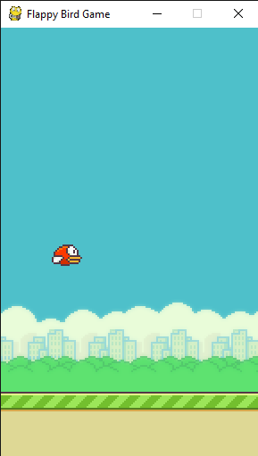

# Flappy-Bird-Game

* This is a Flappy Bird Game in Python that is built using the pygame module.
* The Screen is purposefully kept in the ratio so as to resemble a mobile screen.
* The FPS of the frame is set at 30 fps. We can tweek it in the code
* Modules and libraries used for the code contain ( random, sys module, Pygame module).

# Screenshots 

# Running Game

